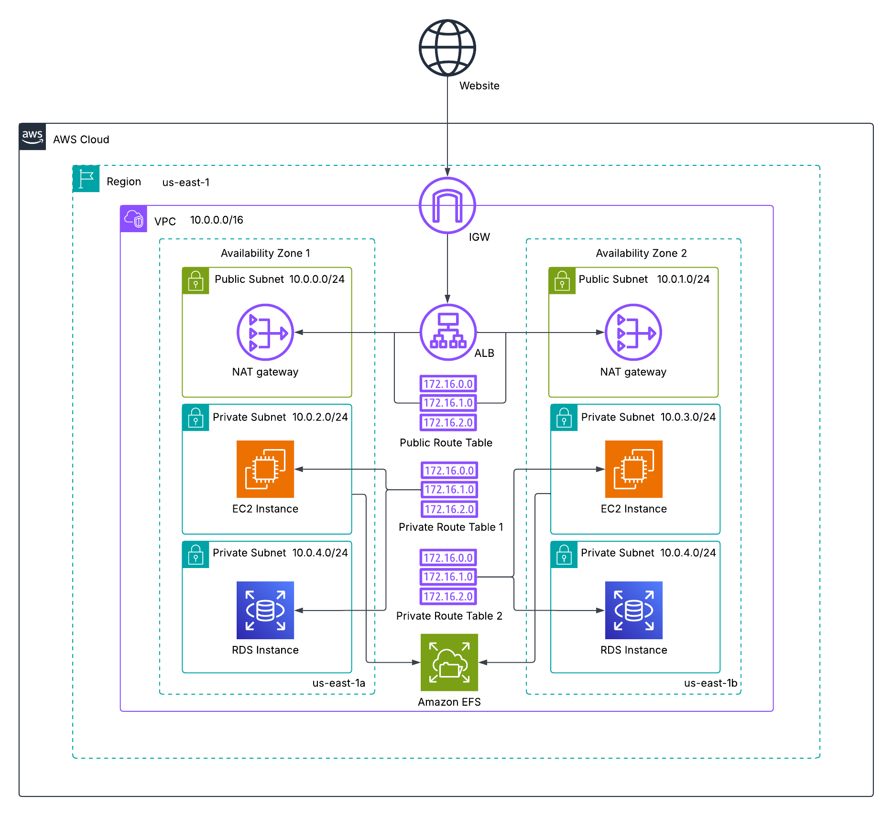
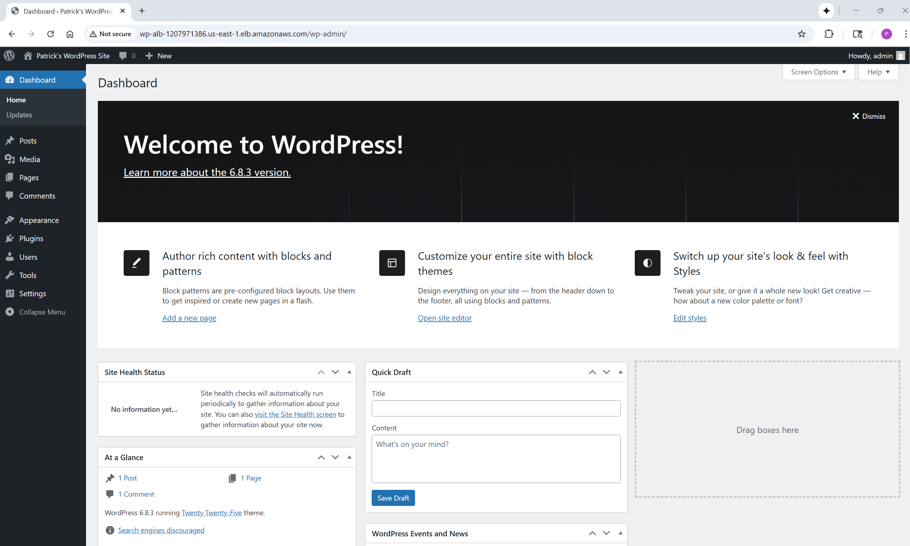

# AWS WordPress Three-Tier Website  
ALB → EC2 + EFS + RDS (Multi-AZ); signals: 100% IaC, SSM-sourced secrets, no public DB access.  

A cloud-native deployment of **WordPress** on AWS that demonstrates a highly available three-tier architecture. The project provisions an **Application Load Balancer (ALB)** fronting two EC2 application servers in private subnets, with shared content on **Amazon EFS** and data persisted in a **Multi-AZ RDS MySQL database**. All infrastructure is automated with nested CloudFormation stacks, following Infrastructure-as-Code best practices.  

An optional **Bastion Host** can be deployed for secure SSH access to the private EC2 instances. If disabled, KeyPairs are still required for stack creation, but SSH will not be available without a Bastion Host.  

[](https://github.com/patrick-heese/aws-wordpress-three-tier-website/actions/workflows/infra-ci.yml)  

## Architecture Overview  
  
*Figure 1: Architecture diagram of the WordPress Multi-Tier Application.*  

### Core Components  
- **Amazon VPC** - Custom networking with public/private subnets, route tables, and Internet Gateway (IGW).  
- **Internet Gateway (IGW)** - Provides outbound internet access for **public** subnets (e.g., ALB, optional Bastion) and inbound access to the ALB.  
- **NAT Gateway** - Enables **private** subnets (application servers, RDS) to initiate **outbound** internet connections (package updates, WordPress downloads, EFS utils, salts API) while remaining **inaccessible from the internet**.  
- **Amazon EC2** - Two WordPress application servers deployed in **private** subnets.  
- **Amazon Application Load Balancer (ALB)** - Public-facing load balancer distributing HTTP traffic to application servers.  
- **Amazon EFS** - Shared storage for WordPress files across EC2 instances.  
- **Amazon RDS (MySQL Multi-AZ)** - Highly available relational database backend for WordPress. RDS resides in private subnets and does not require internet egress.  
- **Security Groups** - Enforcing least-privilege rules between ALB, application servers, database, and optional Bastion Host.  
- **IAM Roles/Policies** - S3 bucket policy to allow CloudFormation to read nested templates.  
- **Amazon S3** - Storing nested CloudFormation templates and deployment artifacts.  

## Skills Applied  
- Designing and deploying a **multi-tier WordPress application** on AWS.  
- Building **nested CloudFormation templates** for modular, reusable infrastructure.  
- Automating **EFS mounts and health checks** to ensure high availability.  
- Configuring **load balancing and target group health checks** with an ALB.  
- Implementing **private subnet egress** via NAT Gateway for secure package installs and bootstrap.  
- Securing connectivity with **granular security groups** and optional Bastion Host access.  
- Provisioning a **Multi-AZ RDS MySQL database** for WordPress persistence.  
- Using **UserData bootstrapping** for EC2 instances (Apache, PHP-FPM, WordPress install).  
- Managing **S3 bucket policies** to enable CloudFormation nested stack access.  

## Features  
- **Highly Available WordPress** - ALB distributes traffic across two EC2 instances.  
- **Shared Storage** - Amazon EFS ensures both application servers use the same WordPress content directory.  
- **Persistent Database Layer** - WordPress data is stored in an RDS MySQL backend.  
- **Automated Bootstrap** - Application servers auto-install Apache, PHP-FPM, and WordPress at launch.  
- **Optional Bastion Host** - Provides secure SSH access for troubleshooting if enabled.  
- **Health Check Endpoint** - `/health` endpoint ensures ALB only routes traffic to healthy instances.  

## Tech Stack  
- **Languages:** PHP 8.4, Apache  
- **AWS Services:** VPC, IGW, NAT Gateway, EC2, ALB, RDS (MySQL), EFS, S3, IAM  
- **IaC Tool:** AWS CloudFormation (nested stacks)  
- **Other Tools:** MySQL Client, AWS CLI  

## Deployment Instructions  
> **Note:** Many commands are identical across shells; the main differences are line continuation (PowerShell: `` ` `` • Bash: `\` • cmd.exe: `^`), environment variables (PowerShell: `$env:NAME=...` • Bash: `NAME=...` • cmd.exe: `set NAME=...`), and path separators.  

> The `CAPABILITY_NAMED_IAM` flag is included for simplicity. It’s only strictly required if the templates create or modify IAM resources (e.g., when adding Secrets Manager access via an EC2 Instance Profile).  

### CloudFormation  
1. Clone this repository.  

2. Deploy the `s3-bucket.yaml` template to create an S3 bucket for nested CloudFormation templates:  
    ```powershell
    cd cloudformation
    aws cloudformation deploy `
    --stack-name wp-cfn-artifacts `
    --template-file s3-bucket.yaml `
    --parameter-overrides BucketName=<YOUR_BUCKET_NAME> AccountId=<YOUR_ACCOUNT_ID> `
    --tags Project=aws-wordpress-three-tier-website
   ```

3. Upload the nested CloudFormation templates to the S3 bucket:  
    ```powershell
    aws s3 cp phase1-networking.yaml s3://<YOUR_BUCKET_NAME>/cfn/
    aws s3 cp phase2-security.yaml s3://<YOUR_BUCKET_NAME>/cfn/
    aws s3 cp phase3-rds.yaml s3://<YOUR_BUCKET_NAME>/cfn/
    aws s3 cp phase4-ec2.yaml s3://<YOUR_BUCKET_NAME>/cfn/
    ```

4. Create an SSM SecureString parameter for the DB master password:  
    ```powershell
    aws ssm put-parameter `
    --name /wordpressthreetier/db/master_password `
    --type SecureString `
    --value 'Your_Password' `
    --overwrite
    ```

5. Edit the `params.json` and `parent-template.yaml` files to customize the deployment.  
   - `KeyName` is the SSH key pair that will be used to SSH to the application servers for any additional configuration or troubleshooting. This can be created separately in the AWS Management Console under EC2 > Key Pairs. Key pairs are required by EC2 regardless of Bastion Host deployment. SSH access to the private EC2 instances requires enabling the Bastion Host.  
   - `CreateBastion` controls the Bastion Host Access. If `true`, a Bastion Host is deployed in a public subnet with restricted SSH access. If `false`, no Bastion Host is created.  
   - `AdminIp` is your public IP address. This is used to lockdown SSH access to the application servers and Bastion Host, allowing only traffic from your IP address.  
   - `DBUser` and `DBPassword` are the credentials that will be used to access the RDS instance. These values are included in the parameter file for convenience. In a production environment, these credentials should be stored and referenced from AWS Secrets Manager.  
   - `S3Bucket` is the name of the S3 bucket created in the previous steps.  
   - `Phase*TemplateURL` is the Object URL of each nested template (e.g., https://<YOUR_BUCKET_NAME>.s3.<YOUR_REGION>.amazonaws.com/cfn/phase1-networking.yaml).  
   - The default values for `VPCCidr`, `PublicSubnet1Cidr`, `PublicSubnet2Cidr`, `PrivateAppSubnet1Cidr`, `PrivateAppSubnet2Cidr`, `PrivateDBSubnet1Cidr`, and `PrivateDBSubnet2Cidr` can be edited in the `parent-template.yaml` file.  

6. Deploy the CloudFormation stack:  
    ```powershell
    aws cloudformation deploy `
    --stack-name wordpress-parent `
    --template-file parent-template.yaml `
    --parameter-overrides file://params.json `
    --capabilities CAPABILITY_NAMED_IAM `
    --tags Project=aws-wordpress-three-tier-website
    ```

**Note:** Ensure the AWS CLI user (`aws configure`) or CloudFormation assumed role has sufficient permissions to manage **S3**, **EC2**, **RDS**, **EFS**, **VPCs**, **Subnets**, **Route Tables**, **NAT Gateways**, **IGW**, **Elastic IPs**, **ALB**, and **Security Groups**.  

## How to Use  
1. **Deploy the infrastructure** using CloudFormation.  

2. **Open the WordPress installer** in your browser:  
    ```plaintext
    http://<YOUR_ALB_DNS_Name>/wp-admin/install.php
    ```

3. **Complete the WordPress setup wizard** in your browser.  

4. **Log in to WordPress** to view the Admin Dashboard.  

## Project Structure  
```plaintext
aws-wordpress-three-tier-website
├── .github/                             
│   └── workflows/                       
│       └── infra-ci.yml                  # Caller workflow → reusable IaC Gate
├── assets/                               # Images, diagrams, screenshots
│   ├── architecture-diagram.png          # Project architecture diagram
│   └── application-screenshot.png        # WordPress admin dashboard screenshot
├── cloudformation/                       # CloudFormation templates
│   ├── parent-template.yaml              # Wires phases (nested stacks from S3 URLs)
│   ├── phase1-networking.yaml            # Networking template
│   ├── phase2-security.yaml              # Security template
│   ├── phase3-rds.yaml                   # RDS template
│   ├── phase4-ec2.yaml                   # EC2 template
│   ├── params.json                       # Parameter values for CloudFormation
│   └── s3-bucket.yaml                    # Template for S3 bucket to store nested templates
├── LICENSE                               
├── README.md                             
└── .gitignore                            
```  

## Screenshot  
  
*Figure 2: WordPress Admin Dashboard UI.*  

## Future Enhancements  
- **CI/CD Integration** with GitHub Actions or AWS CodePipeline for continuous delivery.  
- **Auto Scaling Group** for application servers to dynamically adjust to traffic demand.  
- **HTTPS Termination** at the ALB with an ACM certificate for secure client traffic.  
- **Monitoring & Alarms** via Amazon CloudWatch for EC2 health, RDS metrics, and application logs.  
- **Cost Optimization** with reserved instances or savings plans for RDS.  

## License  
This project is licensed under the [MIT License](LICENSE).  

---

## Author  
**Patrick Heese**  
Cloud Administrator | Aspiring Cloud Engineer/Architect  
[LinkedIn Profile](https://www.linkedin.com/in/patrick-heese/) | [GitHub Profile](https://github.com/patrick-heese)  

## Acknowledgments  
This project was inspired by a course from [techwithlucy](https://github.com/techwithlucy).  
The architecture diagram included here is my own version, adapted from the original course diagram.  
I designed and developed all Infrastructure as Code (CloudFormation) and project documentation.  
